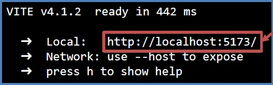

111
222
## Project Overview
This project focuses on building a "Recipe Website" using the `Ant Design (antd)` library. Ant Design is an extensible, user-friendly and data-driven library. Our app utilizes various Ant Design components and data visualization functions such as tables, bar charts, and pie charts to complete the app. We have collected 21 recipes ( `Recipes.json` ) for users to add to their favorites and generate a shopping list table. Additionally, we offer a pie chart to display the proportion of each ingredient category and a bar chart to demonstrate the quantity of ingredient categories.

The quick start guide and website structure will be explained as followed:
***

## Quick Start guide
Before cloning the repository, Make sure you have node.js/npm (https://nodejs.org/en) installed.

### Install the dependencies run the app
After cloning the repository and download to the project folder. Open termianl and make sure in the directory of project, ex: `d:\project_name`.  

Then, run the following command in the terminal. The dependencies will be automatically installed.
```
npm install
```

### Run the app
Once you complete the above installation, you can run the program with the following command.  
```
npm run dev
```
You will see the result:



The website will now run in your default browser at http://localhost:5173/

***

## App Structure
This app contains two pages called `Receipt_List` and `Shopping_Statistic`. User could click and direct to the specific page. The following descriptions will introduce these two pages about correspondent files and components.

<h2>Receipt_List</h2>


In `KitchenPage.jsx`, the design of this page include three parts: `RecipeCard`, `RecipeToday` and `Favorite`.

<h3>1. RecipeCard</h3>

In `RecipeCard.jsx` file, we display each of the recipes in antd component `<Card>` which includes the image, name, video, ingredients and add_favorite function.

<h3>2. Video</h3>

We use antd component `<Model>` to implement the embeded youtube video autoplay function with `<YoutubeOutlined>` icon.  


<h3>3. Button</h3>

Two antd components `<Button>` with `<Space>` to avoid clinging together and set a unified spaceimplement and `<Tooltip>` for the remind.

<h3>4. Ingredient</h3>

When clicking **Ingredient** Button, a `<Drawer>` component will show the information of all the ingredients. 


<h3>5. Favorite List</h3>

When clicking **Add Favorite** Button, will call the addtoFavortie function in AppContextProvider.jsx and immdiately show the selected recipe in favorite list.  

We also provide remove favorite recipe function by double-clicking the image. Another **Reset Favorite** `<Button>` is provided for clearing the favorite list. 


<h3>6. Recommended Today Recipe</h3>

On the top-right of the page is the **Recommended Today Recipe** block which display four recipes randomly and repeatly by using antd `<Carousel>`component in `RecipeToday.jsx`. (See the picture above)  

***

<h2>Shopping_Statistic</h2>  

In `Statistic.jsx`, the design of this page include three parts: `Table`, `Pie` and `Bar`. 


<h3>1. Table of the Shopping List </h3>

In `TablePage.jsx` file, we use antd component `<Table>` to display the ingredients shopping list information according to the favorite list. We also provide sorting function for user to find the name, quantity and category of each ingredient.


<h3>2. Pie Chart</h3>

In `PiePage.jsx` file, we use `<ant-design/plots>` component `<Pie>` to visualize the data from the category of shopping list. The Pie chart could display the proportiong and do the interaction like `element-highlight` when clicking to specific category.

We also implement antd component `<notification>` to remind user when the category: meat is above 2%.


<h3>3. Bar Chart</h3>

In `BarPage.jsx` file, we use `<ant-design/plots>` component `<Bar>` to visualize the data from the category of shopping list. The Bar chart could display the numbers of each category. 


***
## Reference
**NPM**  
https://nodejs.org/en

**Ant Design**  
https://ant.design/

**Ant Design - Component**  
https://ant.design/components/overview

**Ant Design Chart- Pie**  
https://charts.ant.design/en/examples#pie-basic

**Ant Design Chart- Bar**  
https://charts.ant.design/en/examples/bar/basic#basic


